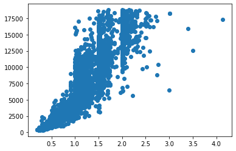

## Publishing Jupyter notebooks

Sometimes we might want to publish and present our Data Science projects. The Anaconda command line utility provides a quick way to convert a notebook into Markdown using the following command:

```bash
   > jupyter nbconvert --to markdown path/to/notebook.ipynb --output-dir path/to/outputdirectory
```

There are other formats you can convert it to, including HTML using the `--to html` option.

### Console output

This is how Python code and it's resulting output appears:


```python
print("x,", "y,", "z")
```

    x y z
    

### DataFrames and Series

DataFrame outputs appear as tables:


```python
import pandas as pd

diamonds = pd.read_csv('diamonds.csv')
diamonds.head()
```


<div>
<style scoped>
    .dataframe tbody tr th:only-of-type {
        vertical-align: middle;
    }

    .dataframe tbody tr th {
        vertical-align: top;
    }

    .dataframe thead th {
        text-align: right;
    }
</style>
<table border="1" class="dataframe">
  <thead>
    <tr style="text-align: right;">
      <th></th>
      <th>carat</th>
      <th>cut</th>
      <th>color</th>
      <th>clarity</th>
      <th>depth</th>
      <th>table</th>
      <th>price</th>
      <th>x</th>
      <th>y</th>
      <th>z</th>
    </tr>
  </thead>
  <tbody>
    <tr>
      <th>0</th>
      <td>0.70</td>
      <td>Premium</td>
      <td>J</td>
      <td>VS2</td>
      <td>61.2</td>
      <td>60.0</td>
      <td>1940</td>
      <td>5.73</td>
      <td>5.70</td>
      <td>3.50</td>
    </tr>
    <tr>
      <th>1</th>
      <td>1.02</td>
      <td>Good</td>
      <td>I</td>
      <td>SI1</td>
      <td>64.2</td>
      <td>53.0</td>
      <td>3998</td>
      <td>6.30</td>
      <td>6.26</td>
      <td>4.03</td>
    </tr>
    <tr>
      <th>2</th>
      <td>1.07</td>
      <td>Ideal</td>
      <td>H</td>
      <td>SI1</td>
      <td>62.0</td>
      <td>57.0</td>
      <td>4918</td>
      <td>6.56</td>
      <td>6.51</td>
      <td>4.05</td>
    </tr>
    <tr>
      <th>3</th>
      <td>1.20</td>
      <td>Very Good</td>
      <td>G</td>
      <td>SI2</td>
      <td>62.6</td>
      <td>60.0</td>
      <td>5116</td>
      <td>6.68</td>
      <td>6.74</td>
      <td>4.20</td>
    </tr>
    <tr>
      <th>4</th>
      <td>0.34</td>
      <td>Very Good</td>
      <td>E</td>
      <td>SI1</td>
      <td>60.3</td>
      <td>57.0</td>
      <td>596</td>
      <td>4.53</td>
      <td>4.56</td>
      <td>2.74</td>
    </tr>
  </tbody>
</table>
</div>


Series outputs appear as code blocks:


```python
colour = diamonds.color
colour.head()
```


    0    J
    1    I
    2    H
    3    G
    4    E
    Name: color, dtype: object


### Rendered graphs

Graphs are generated and saved as PNG image files and placed in a directory adjacent to the file you're exporting and placed inline:


```python
import matplotlib.pyplot as plt

plt.figure()
plt.scatter(diamonds.carat, diamonds.price)
plt.show()
```


    

    


### Formulas

Formulas appear like this:

$$ \mu = \frac{1}{n}\sum_{i=1}^na_i $$


